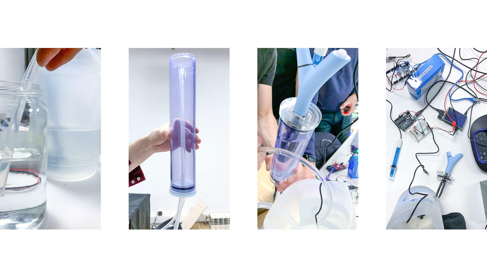
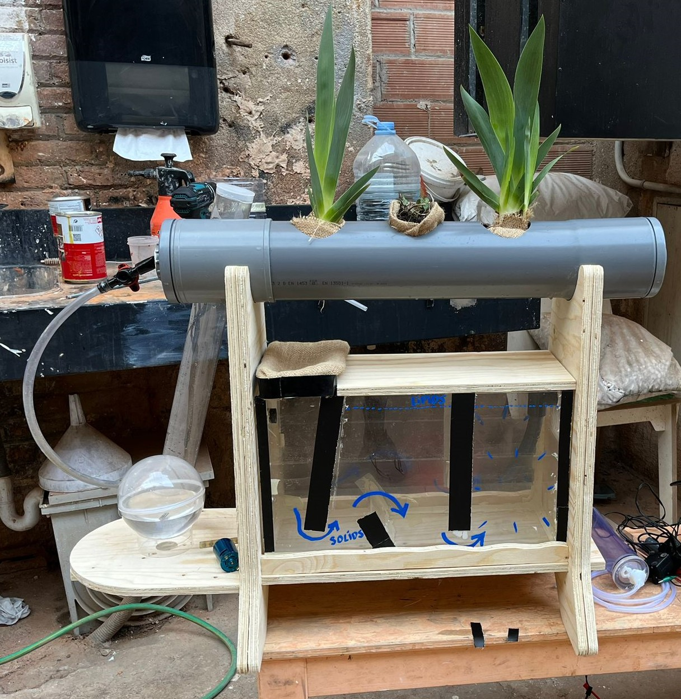
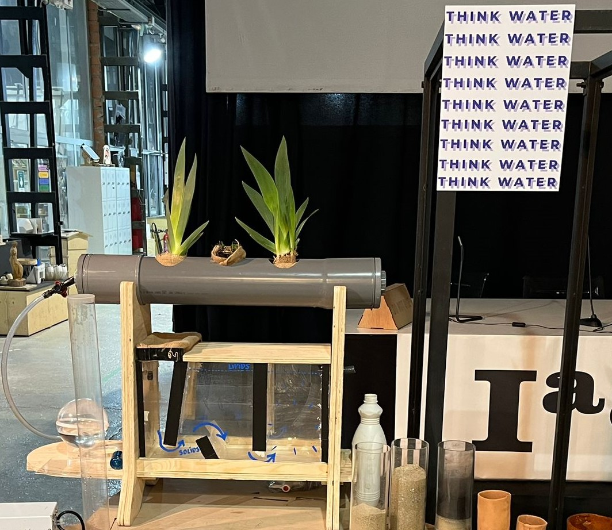

---
hide:
    - toc
---

# 
in process...

After a first trimester of a lot of introspective work, learning and new experiences, I decided to change my course regarding my master's project. Without leaving aside the process I had started, in relation to regenerative behavior and the redesign of human habits & conveniences, I decided to focus more on something that has always been my grounding cable and connects me with the person I want to be: water. I believe water is so important in our lives, that we must give more value to it. By this I mean to understand our consumption, be consciouss of the importance of having clean water at our disposal, and overall dont over waste it and take advantage of it in all its forms. 
Water is not just a resource, it is part of our lives, our body is composed of 70% water, therefore it is necessary to take care of it and keep in mind its importance. I do not want to fall into another speech about the importance of water, but I feel that as a designer I have the opportunity to act through my knowledge and communicate the value of water in our lives and the planet. That is why I began to explore from permaculture natural methods of water filtration, with plants that through their roots generate a network of filtering known as "rhizofiltration". Im so engaged with this new stage of exploration and interested in understanding how greywater, rainwater or other forms of water we waste can be reintroduced to a new system where water is cleaned by natural filtrations to grow life, as plants or make it drinkable or have some useful end. 

*1st Intervention*

So, with some classmates also interested in water we made a first step on this big exploration. After brainstorming various ideas related to water and urban (domestic) horticulture, we landed on the idea of making a device that senses a few properties of water that are relevant for plants (temperature, electric conductivity, pH).

Link for more info...

<blockquote class="embedly-card"><h4><a href="https://github.com/ramiroarga/WATER">GitHub - ramiroarga/WATER: Water explorations for Microchallenges</a></h4>
Water explorations for Microchallenges Hey!! Welcome to our WATER REPO! Here we will be updating our work for the Microchallenge´s... to do: add electronics steps and schematics add picture of final product under 'the system' add code and lasercut files to repo proof-read / final touches add this as README.md to the repo This repository documents a water testing tube designed and built by Josephine, Ramiro, Cagsun, and Korbi during the first MDEF 22/23 microchallenge.
</blockquote>

*Final term Interventions*

I decided to start prototyping different filtration stages for greywater, so I built a lipids trap, which would be the first stage of the water depuration system.
The lipid trap consists of a recipient where water flows through in a certain direction passing through some “flow traps” that give direction to the greywater entering from one side to the other separating lipids (oils and fats) by density difference. I made it transparent in order to be able to see the flow and function of it. Was a interesting exercise to understand how it works and to build it effectively without leaks and support the water pressure and weight.
The trap´s input side has a coarse cloth filter that avoids big compounds (solids) entering in the system that works as a first filter before the flow traps.

The next step was to build the following stage of the water depuration/filtration system. So I started researching how to filter water with aquatic plants while they grow in the system. I connected with Sanitha, Founder of Planteka plant shop in order to better understand the plant world and how they can do this work. Also know which plants are the best to do an effective filtration and have access to them to use them in our system. Also connected with an Argentine cooperative that builds depuration wetlands in rural areas of Córdoba, Argentina for certain companies and rural places. They use only one type of plant called “vetiver”, an Indian plant, to do the job and they say it works really well and quickly. But in our project one of the important facts was to use local plants, from Catalunya, in order not to alter the local natural ecosystem. 

So I decided to use some local plants such as blue IRIS and aquatic MINT. Both can make the depuration job by creating an underwater mesh with their roots that will behave as a filter when water flows through them. The prototype of this tube with the plants was built, together with a wooden cabinet that will put all the system together. The plants are too young so we couldn't make it functional yet, as the roots need to grow enough. 

After this filtration stage, where plants take part in the process, we finally add a last stage where water is oxygenated by a vortex and gives the opportunity to celebrate water by an artistic outcome in the form of an illuminated vortex.

Miro board for more access to my mind, notes and inspirations...

<iframe width="768" height="432" src="https://miro.com/app/live-embed/uXjVPOijHeE=/?moveToViewport=-789,505,20408,10018&embedId=268344554546" frameborder="0" scrolling="no" allow="fullscreen; clipboard-read; clipboard-write" allowfullscreen></iframe>