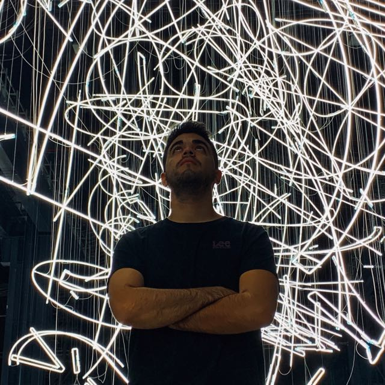

# Hi! ;)

My name is Ramiro, I’m an Industrial Designer, graduated from Universidad Nacional de Córdoba (FAUD) in Argentina, and finished my career as a product designer at IUAV University in Venice, Italy. 
Since university, I've been designing products and services that sought to solve various problems. At IUAV Venice, I learned some physical computing, using arduino to design in the field of social robotics. I worked as an Innovation Advisor/Project coordinator at the Innovation Laboratory of the Municipality of Córdoba, Argentina (CorLab). I was focused in coordinating social innovation and digital divide projects. From design, I experimented new ways to generate public value, enhance the relationship with citizens, and provide new channels and collaboration from agile work methodologies. 

I consider myself a proactive person, with good learning and leadership skills. Also, I have very good predisposition for teamwork and I’m used to interdisciplinary work, discovering new opportunities and innovative solutions with team colleagues. I believe collaborative work and systemic thinking are essential paths for solving big worldwide problems. As a designer for Emergent Futures, I want to be a change-leader, understand new paradigms, experiment and
critically intervene the real world.

Please feel free to take a look to some of my main projects at **[my portfolio](https://www.behance.net/ramiarganafd03)**
