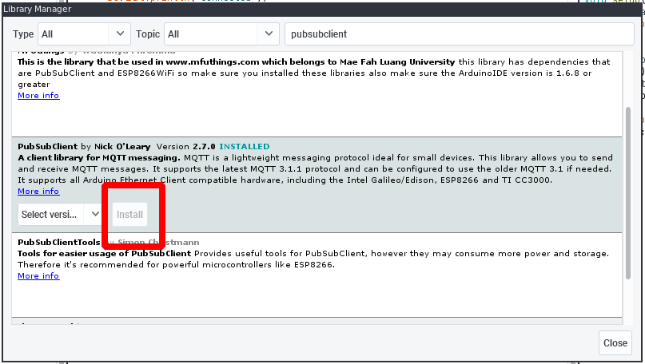

## MQTT

### Install MQTT library:

Open the **Library manager** in Arduino menu _Sketch -> Include Library -> Manage Libraries_ and search for the **PubSubClient** library, install it.



!!! note "PubSubClient Source"
    You can find the full API documentation for the _PubSubClient_ library [here](https://pubsubclient.knolleary.net/api.html)

For the first test you can copy/paste the [code example](#code-example) in this document.

### Setup WiFi

Change **WiFi settings** and mqtt_server address.

```
const char* ssid = "YOURWIFIHERE";
const char* password = "YOURPASSWORDHERE";
const char* mqtt_server = "SERVERADDRESS";
const char* mqtt_user = "MQTTUSER";
const char* mqtt_pass = "MQTTPASS";
```

### Receiving data

* If you are **suscribing to a topic** change subscription topic name inside the reconnect function

```
// SET THE TOPIC TO SUBSCRIBE HERE
client.subscribe("testing");
```

* And modify the callback function to control your actuator.

```
// USE RECEIVED DATA HERE
if (strPayload.toInt() > 5) digitalWrite(LED_BUILTIN, LOW);
else digitalWrite(LED_BUILTIN, HIGH);
```

### Publishing data

* If you are publishing data change the topic, and modify the code in the loop function to get your sensor reading and publish it.

```
// READ YOUR SENSOR DATA HERE
float value = analogRead(A0);

// Send value as characters
char msg[50];
snprintf (msg, 50, "%f", value);
Serial.print("Publish message: ");
Serial.println(msg);

// SET THE TOPIC TO PUBLISH HERE
client.publish("outTopic", msg);
```

## Code example

```
--8<-- "education/material/embedded/assets/snippets/esp8266_mqtt.ino"
```