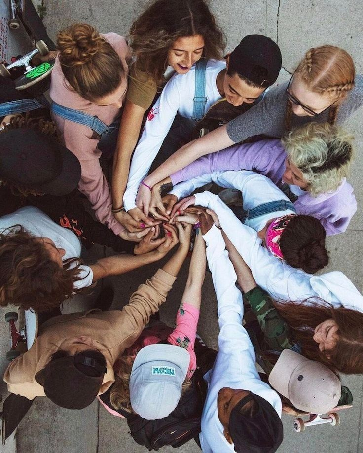

---
hide:
    - toc
---

# Bootcamp

Final term 1 poster

*My Fight*

As a designer and citizen of the world, I am constantly mutating and acquiring new knowledge. My journey started last year where I experienced a social innovation process that changed my perspective of things. This was a food education project for children living in vulnerable socio-economic situations, to have access to tools for sustainable food production and connection with nature through playing resources. This experience took me through a collaborative design process where I learned what real teamwork means. In its transition, a team of around 40 people was generated, who contributed their expertise to the project to achieve a tangible and creative solution.

So I began to expand my knowledge and broaden my interest in collaborative innovation, that is what my poster represents. Books as the “Web of life” (Fritjof Capra), “Mutual Aid-the other law of the jungle” (Servigne and Chapelle), “How War, Pornography, and Fast Food Have Shaped Modern Technology” (Peter Nowak) and “ The city of tomorrow ..” (Ratti and Claudel) have made me understand my role as designers and change-maker in the real world and how nature is the reference to achieve in a collective way to move forward as living beings that inhabit this planet.

Although every process requires facing fears, new challenges and changing habits, I'm enjoying my journey by growing as a human being as part of nature and I trust my process. I am a very curious person and eager to learn about everything, that is why I don't feel able to determine a specific path to follow, as my fields of interest are several. I feel that I have incorporated the "how" and it has to do with the tools I have been talking about. As this extract from Dunne and Raby mentions: *“To achieve change it is necessary to unlock people’s imaginations and apply it to all areas of life at a microscale. Our work is meaningless unless it ignites imaginations and provokes debate: design by mutation is intrinsically collective. Designers produce mutations, some of which will grow, evolve, and develop into tangible artefacts that cause global change – driven to realization by the energy of the crowd”.*

My challenge is to find how to unlock people's imagination, generating those mutations within my fields of interest. I have a potential interest in connecting changemakers in order to achieve bigger impacts towards the construction of resilient places. I believe collective work is the most important thing in order to achieve real and big impact solutions. This trimester I was experimenting in the fields of interest where I want to intervene. I explored the food waste system, technologic and material waste and the transport means of them by a specific community over Barcelona and finally group my interests as "human habits and conveniences" by understanding the way we consume and generate waste. Then I understood that these habits are responses of our actual mental situation and life, so I started exploring human behavior and how to enhance transformation to a regenerative life, connecting more with nature and personal well-being.

I feel that I am moving forward on my path, I intend to explore other of my interests and to continue learning about each intervention I do; understanding what is valuable for me and want to transform.

My initial poster:

*Personal Development Plan*

