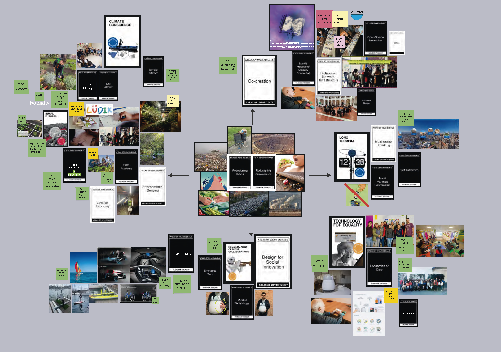

---
hide:
    - toc
---

# Atlas of Weak Signals

Welcome to my Design Space...

This space represents digitally and graphically my mind at this moment of my life... To begin with, I feel the habits and comforts that we humans have as a nucleus that gives origin to my interests and concerns. This for years has been affecting the natural cycles of the planet and all its resources. And personally it makes me very uncomfortable to understand these effects but continue to exercise bad habits blaming the system. Some bad habits of human beings can be seen through the images surrounding these two cards.
 
Next to what for me is the most important card in the space: CO-CREATION, I mention a quote I really liked from a book: - “To achieve change it is necessary to unlock people's imaginations and apply it to all areas of life at a microscale. Our work is meaningless unless it ignites imaginations and provokes debate: design by mutation is intrinsically collective. Designers produce mutations, some of which will grow, evolve, and develop into tangible artifacts that cause global change -- driven to realization by the energy of the crowd.”-
This is directly related to “my fight”, because collaboration and collective work are the main pillars for the creation of solutions with real impact. All my design space is based on my struggle and my interests, told through my experiences. Throughout the space I try to capture my concerns along with experiences of projects, programs and products in which I have participated in my life... (or at least the ones that marked me the most).
 
From collaborative innovation, I can detect food as the main focus of interest, deploying in it issues such as food security and sovereignty, food education and water literacy and its uses. Awareness brings together all the edges of this sector, where environmental sensitivity, nature and circular production and consumption models (circular economy) are also linked.
 
Another area of interest is design for social innovation, its link with advanced technology, robotics and above all the creation of products and services from conscious technology. Technology that addresses social and economic vulnerabilities, which aims to reduce the digital divide. Within this area, I show projects in which I have participated as coordinator and designer, participating with real users who are affected daily by these problems, in some achieving concepts and prototypes and in others achieving impact solutions in the public sector. I chose to accompany this card that I found valuable: Economies of care.
 
I also highlighted the long-termism card as important, because it seems to me a key issue to consider in order to continue on this path as a change-maker for emerging futures. In it I emphasize programs based on multi-scale objectives and accompany it with the card of self-sufficiency, as an important element to achieve long-term solutions.
 
Finally, another area of interest is the mobility of people, understanding this as the means of transportation used and how they seriously impact the planet. That is why I chose the card of: Conscious Mobility, which in turn is related to technology and society.
 
*RAMIRO*

[My Design Space]

<iframe width="768" height="432" src="https://miro.com/app/live-embed/uXjVPOijHeE=/?moveToViewport=-1073,-1186,2044,1442&embedId=42014386884" frameborder="0" scrolling="no" allowfullscreen></iframe>
