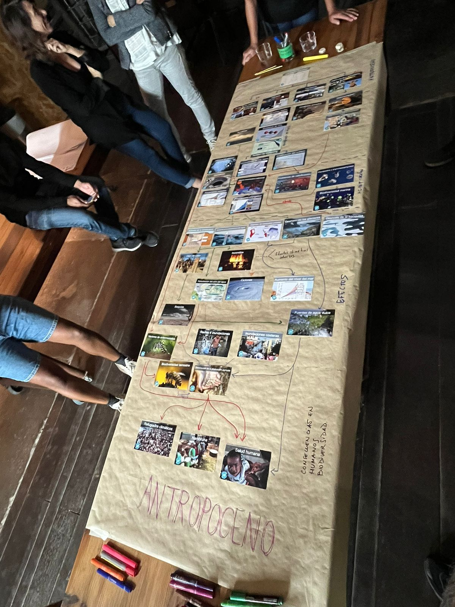
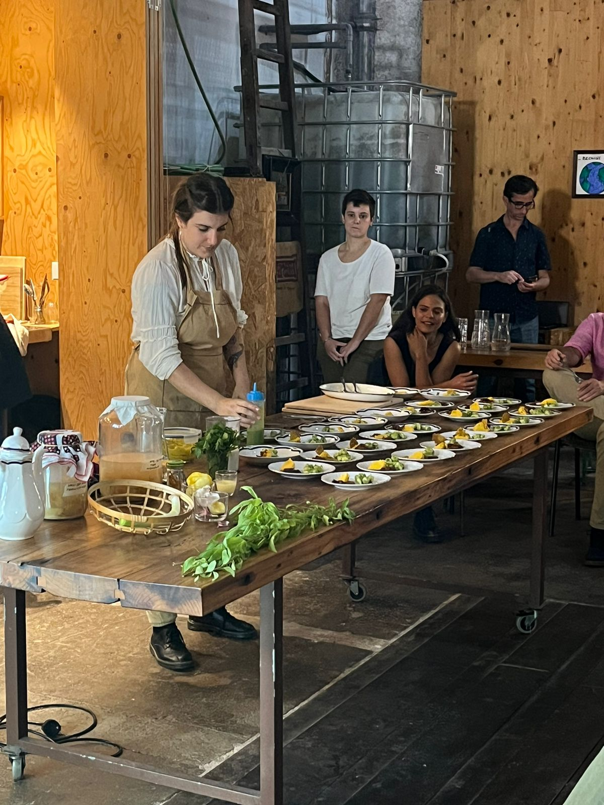
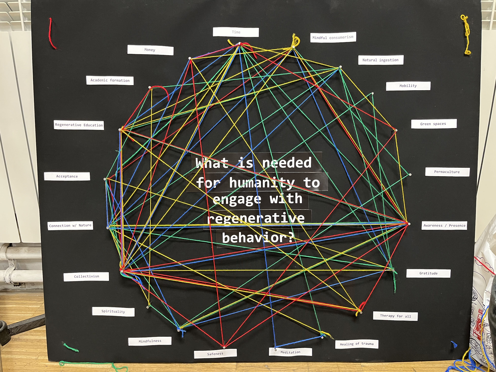

---
hide:
    - toc
---

# Initial weeks

**The role of prototyping in design**

Some of my experience in Roles of Prototyping:

**Role 1: The prototype as a Experimental Component** 

*Insulator for High Voltage Wiring:* 

I have used this role in order to test specific characteristics of the product the client wanted and for the role it had to accomplish. In this case, it had to adapt to a certain structure and hold a high voltage wire and should have an opening system to remove and insert cables quickly and adjust them efficiently. The prototype was made in 3d printing and was used to achieve these specifications, including the development of the electrical test to measure that no arcing is generated.

https://www.behance.net/gallery/83116577/Aislador-para-Cableados-de-Alta-Tension

*TIP: Robot social para personas mayores (Therapy for isolated people):*

The present project deals with the design of a Social Robot dedicated to the assistance and active insertion in society of elderly people. Through the use of an intelligent device, the elderly person is stimulated to rediscover activities that do not confine them within the walls of their home. With the purpose of converging in the same place with other users who share similar interests and are in the same situation. Achieving socialization among them, providing a new motivation to leave home.

https://www.behance.net/gallery/96238617/TIP-ROBOT-SOCIAL

**Role 2: The prototype as a means of inquiry** 

*"Ciudad Digital:"* 

Is a program that seeks to promote and disseminate different spaces of cultural interest in the city by implementing new technologies, promoting innovation through a process of Digital Transformation. It functioned as a means to disseminate the city's cultural spaces to the community and to inquiry the incidence and acceptance of digital technology in society through augmented reality.

https://www.behance.net/gallery/136512101/Ciudad-Digital

**Role 3: The prototype as a Research Archetype** 

*Premium Electric City Car Concept Exterior and Interior Design.* 
A graphic product of a concept research in the field of automotive transportation looking to a short-term future.

https://www.behance.net/gallery/104500733/LAMBORGHINI-SPLENDOR-E
https://www.behance.net/gallery/110377549/LAMBORGHINI-SPLENDOR-E

**Role 4: The prototype as a Vehicle for inquiry**

*LUDIK:* 

Social Innovation Design Project in Food education for children living under vulnerable socio-economic conditions. In this prototyping case, it was a large process where documentation and continuous analysis was made. The prototype was a reflection of the research and represents the result of the whole process, not taking major importance the final tangible prototype. Also, LUDIK was a program created to investigate and create a database of children under these situations, and a means of generating information for future social interventions.

https://www.behance.net/gallery/136349695/Innovacion-social-%28Educacion-Alimentaria%29

Although I have had experiences prototyping in the different roles, I think I would like to intervene deeper into role 2 "The prototype as a means of inquiry". But I believe that several roles are needed to intersect and be together for a better understanding and development of the design process you carry on.
I would like to experiment in intersecting roles 1 and 2, in order to achieve the development of a prototype as an instrument of inquiry but from an experimental experience.

Research through Design Toolbox

[Research through Design Toolbox MAP](https://embed.kumu.io/747fad9245edd7aaa130fc515658b853)

# Design Interventions

**FIRST INTERVENTIONS**

My focus of interest starts from the understanding of the habits and convenience that we have as human beings, in terms of consumption, participation in the system and relation with nature. As I have been working the last years with food education, my first approach was to try to understand more deeply the food system and our impact. I got to know Nest City Lab, an urban lab for sustainability that experiment with everything that can lead us towards a more meaningful life. It is not only a working space, but a community of practice that cares about the planet and all beings. I started connecting with them and participated in some workshops. One of them caught my interest, it was about zero waste food, so I started learning more about it and I started to put it into practice in my daily life. 

Then my first intervention came, together with some colleagues that were also interested in the food system and waste. We decided to collect our food and plastic waste from almost a week and then meet for dinner and cook collectively from all our wastes.

**Reflection from Food Waste Dinner**

Before:
What are my expectations about cooking with food waste?
-I really don't have many good expectations, we will be able to cook something but i don't think the taste will be really nice. Many waste we take will be thrown away and not transformed into food. However, the experience will be amazing and we will have a good time together cooking and having fun!
Why do I think of this as food waste? / why would I normally be throwing it away?
-I brought potato and sweet potato peels that i didnt eat when cooking smashed potatoes, and some old olives with its water that nobody wanted to eat in my house. Also some old vegetables that looked bad and were old that I was going to throw away.

After:
How was the experience? What surprised you?
-The experience was really good! I had a lot of fun, we had 3 hours of full collaboration in all the food we cooked, each one had a recipe that we wanted and was able to make with the waste we had. After cooking we shared a nice moment eating all our creations and communicating our feelings and reactions to each thing we tried.
All the recipes had an attractive appearance and the taste accompanied it.
We finally threw away the waste of our "food waste", the result of this was only a bag from almost 5 bags we had initially.

*This moment of my journey was very important to understand my lifestyle in relation to waste, my food awareness and so I started to explore my lifestyle habits. I began to explore myself, get to know myself and open my knowledge through experiences, books and other resources. This was the point where I began to understand this educational process as something more than a professional path of multiple learning. I understood that I was changing as a person, it gave me the opportunity to be aware of who I am and who I want to be in the future. So I began to feel that it is not a parallel journey to my life, but that they are unified.*

![](../images/758ae70a-8d0b-775f-b2b2-092ddbe4e7ce.gif

**What is needed for humanity to engage with regenerative behavior?**

I started to explore other paths related to human habits and convenience, so I began to connect with Antonio who was also interested in this and wanted to understand his thoughts and perspective. So we started to understand the context around us, interests and tools to start thinking about a big change.
Both sides were connected with the purpose, Antonio´s side from mental health and the central nervous system as the focus of human behaviors and me from nature connection, food, water and sustainable practices. So we decided to align fields and work together. 

In this collaboration I realized how important mental health was and the role it played in relation to human behaviors and bad habits, in terms of consumption and active -but unconscious- participation in the established systems. And we learned that we didnt want to talk about sustainability, but regeneration. As sustainability aims to maintain what already exists for use by future generations, while regenerative design goes a step further and actually seeks to leave ecosystems better than we found them.

We call to action! We decided to take advantage of the connection we have with some Nest City Lab (Apoc-Apoc) members to conduct a session (intervention) to exchange opinions and ideas about behaviors we have in our daily lives. This helped us to learn about the natural habits they have to achieve a state of wellbeing, learning about new activities from others in relation to nature and mental health. The intervention was really interesting, the outcomes were important for us to continue our learning journey and prepare the next intervention for the “Design Dialogues”. 

.jpeg).jpeg)
.jpeg)

Among the results obtained, one of the most interesting points was to understand the privileged situation we have and to be able to think about regeneration, connection with nature and wellbeing. We both come from Latin American countries, where the predominant issues are poverty, inequality and its consequences, where people have no time, education or money to think about regenerative behaviors and resilience is every day a bit far away. It is hard and disappointing to say but it is the reality of many countries and humans in the world. Therefore, from our shoes we feel that we can contribute our seed to begin to turn this situation around and believe in a resilient future by improving access to regenerative education.

For the Design Dialogues, we decided to create another stage of intervention. We detected 20 determinants that for us were the most important for humanity to engage with regenerative behavior. These were divided into 4 different groups: Spiritual, Context/System, Privilege and Mental health. So we created a board with a big circle with all the determinants and people should connect with color thread the ones they think are the most important for humanity to engage with regenerative behavior. The objective of this intervention was to understand people's thoughts towards regenerative behavior and learn other important determinants that we were not contemplating. 

The physical result was a catching visual map with 4 different color threads that people used for showing their selection. The cognitive outcomes were even better, the debates and dialogues generated with each participant made me open my mind with some factors I were not realizing.

The most selected determinants were: Collectivism, Connection with nature, Time, Awareness/Presence, Regenerative Education and mindful consumerism.

Some resume video of our intervention: 

<iframe src="https://player.vimeo.com/video/787541624?h=8a7ed1fcf1&amp;badge=0&amp;autopause=0&amp;player_id=0&amp;app_id=58479" frameborder="0" allow="autoplay; fullscreen; picture-in-picture" allowfullscreen style="position:absolute;top:0;left:0;width:100%;height:100%;" title="Video.mov"></iframe>

