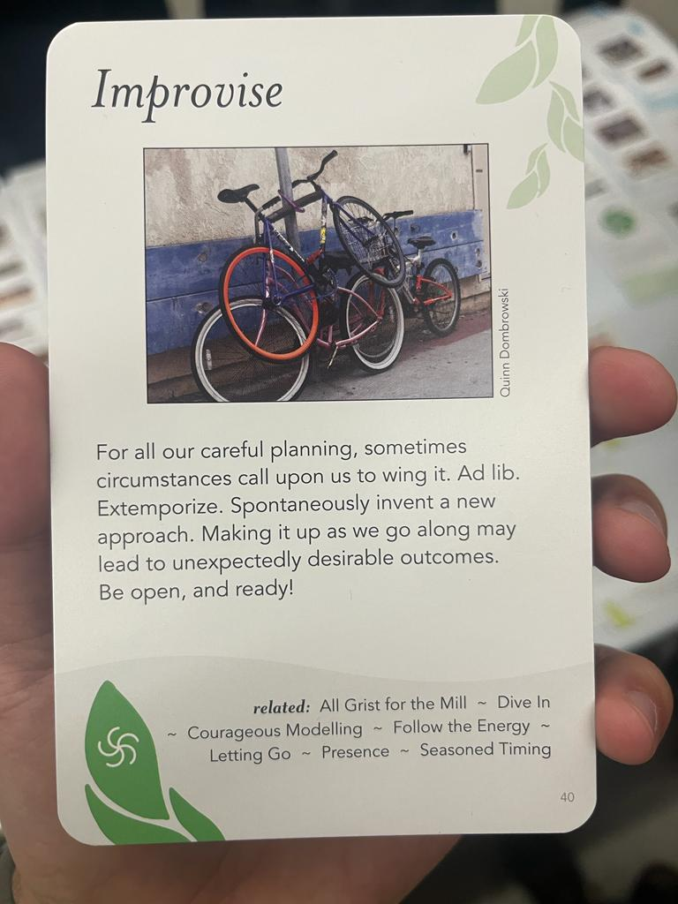

---
hide:
    - toc
---

# Community Engagement

Reflection

These were days where we could talk in depth about design from all its edges, mainly from the people and how we act or act against the solution of various problems. The main focus was on communities as a medium and as the center of design, understanding how to map the environment and everything that surrounds us as designers. And that is where it is necessary to understand what is necessary to map, to learn to distinguish what is important, what exists and what does not, what affects the most, the causes and effects, and its evolution over time. In recent years as a designer and innovation consultant, I have had many experiences working alongside communities in the solution of various social problems. I understand what these processes mean and this subject helped me to update some tools and ways of approaching collaboration from communities for a common goal. 

It is important to understand that as human beings we must unlearn and re-learn and re-understand many things. And it is also important to understand that as designers we should not invent anything new, but take advantage of what has been created to improve it and connect what has been invented to design new patterns of behavior and consumption for a regenerative future.

Talking about communities is not only about human beings, but also about the other living communities that share the space we inhabit, understanding this as a hole complex system. The human-non-human connection is essential for our habitat and we must learn to live in collaboration with the other species that share our habitat.
This is extremely important to me, and led me to continue researching the topic, trying to learn more about interspecies collaboration, through several sources, including the book: "Mutual Aid: The other law of the jungle".

Group work card decks

We were given these cards and we should choose the best for us and then explain why. I chose the card "Improvise" because is something I want to improve and practice in my life, this doesnt means I dont improvise, I do! But i feel its like a reminder for never forget it, because improvising most of the times give the best results. Always planning too much and have fear of trying makes things difficult and dont give the chance of creating, failing and achieving the results we want. I feel like a person that plans things sometimes so much that makes the process so heavy and slow. So I would like to have in mind the art of improvising even more!

Creativity Community Engagement

Nest City Lab - APOC APOC Session

.jpeg)

.jpeg)

.jpeg)

