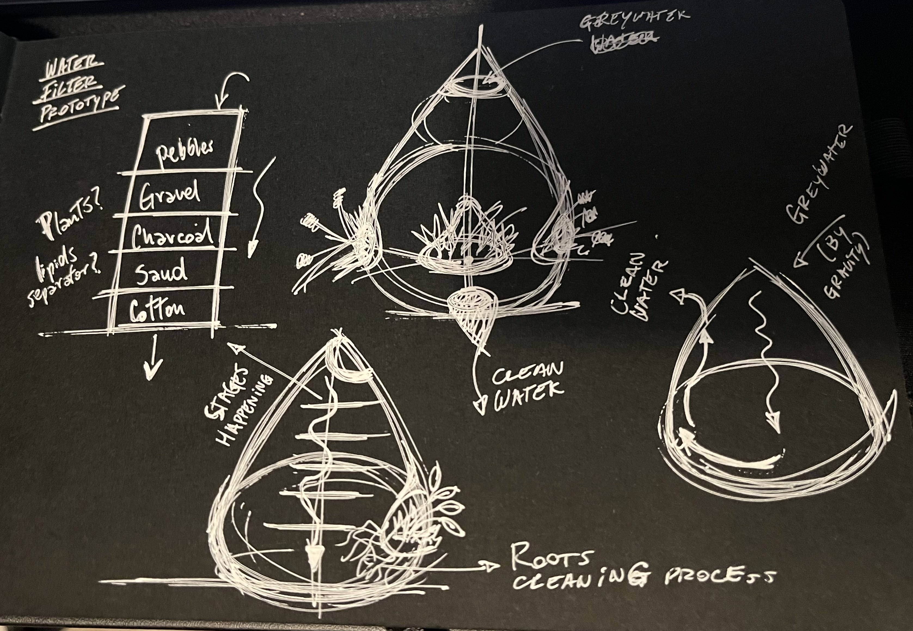

---
hide:
    - toc
---

# Digital Prototyping for Design

Here I will be showing some notes, outcomes and reflections of the process of the seminar!

*Basic E&C*

During this task, we acquired knowledge on how to trigger a buzzer in order to generate sound. It proved to be a captivating exercise that further deepened our comprehension of the fundamental principles behind electronics and Arduino programming.

My contribution involved designing the board schematics, carefully considering the various components and their harmonious collaboration in sound production. The setup was relatively simple, involving a ground connection and an additional pathway for output via pin 13 of the Adafruit Feather. To ensure success, I extensively explored online repositories to identify suitable board components and compatible code for my project Consequently, the device successfully rendered the Pirates of the Caribbean theme melody!

*Design Tools*	

In the subsequent task, our objective was twofold: to establish the parameters for a croissant and to generate a 3D design employing algorithmic thinking applied to any object or concept. I hand-sketched a croissant with different sections that were traslated through 2 lines in the space, till the middle and then created the final form by simmetry.

*2D Fabrication*	

For this activity, our assignment entailed developing a parametric model and subsequently fabricating it using the laser cut machine. I decided to use the resources and time to make some laser cuts for the making of a lipid-trap I needed to built for the master project. So I designed the trap (acrylic box) in order to be transparent and could see how the water flowed and lipids and solids were divided by densities. And I laser cutted it and then glue it, the results were so good! Also I didnt choose to make something else for the activity because I have already experience in design and prototypes by laser cutting, so i decided to make something with more sense for the project. Here some images!

*Inputs / Outpus*

*Networking*

The first class was a general reminder on arduino system, parallel systems and general terms of electronic prototyping. I feel motivated about this seminar, i like playing and learning electronics! We played on making some buzzers melodies to sound with some open-source codes!

<iframe src="https://player.vimeo.com/video/795018353?h=b476ddf82d&amp;badge=0&amp;autopause=0&amp;player_id=0&amp;app_id=58479" frameborder="0" allow="autoplay; fullscreen; picture-in-picture" allowfullscreen style="position:absolute;top:0;left:0;width:100%;height:100%;" title="IMG_9894.MOV"></iframe>

... Some more about arduino and the task of turning on a led with a push button and understand the morse code (dash-dots) by recepting with a light sensor.

<iframe src="https://player.vimeo.com/video/798407899?h=8e50bbaf11&amp;badge=0&amp;autopause=0&amp;player_id=0&amp;app_id=58479" frameborder="0" allow="autoplay; fullscreen; picture-in-picture" allowfullscreen style="position:absolute;top:0;left:0;width:100%;height:100%;" title="IMG_9959.MOV"></iframe>

*3d softwares*

In the second class, we reviewed 2d and 3d softwares and made a MIRO board with all the softwares we know how to use. Then we learned about colors, pixels and vectors, PPI/DPI (72PPI normal for monitors and the internet) and image formats (GIF,JPEG,PNG).

Also learned about (TOPoPT) Topology optimization / generative design, mathematical method that optimizes material layout within a given design space. Generative design is not about designing, its about designing the system, we start from nothing, not the other way around.

For the class challenge, I imagined a filtering water system for domestic use, draw a quick sketch and made a 3d model in Rhino, rendered in Vred and finished in Photoshop. Here some images of the process.

.png)
.png)

*3d Printing*

In this class we understood how bidimensional fabrication works and its types. We went through laser systems, laser source and focus. Learned specially the lasercut, its functions, how it works and results of it. Also we understood materials that should and not be used in laser cutting.
Best for cutting: cardboard, plywood, mdf, acrylic /polypropylene

Some 3d printing and scanning tasks...

I wanted to print a volcano ashtray as an example for testing the printer and parameters in order to know how it works better for future printings. Here I can show some of the process, the 3d design modelling, print and scanning.

<iframe src="https://player.vimeo.com/video/817798362?h=00a09698c6&amp;badge=0&amp;autopause=0&amp;player_id=0&amp;app_id=58479" frameborder="0" allow="autoplay; fullscreen; picture-in-picture" allowfullscreen style="position:absolute;top:0;left:0;width:100%;height:100%;" title="scan 3d print.mp4"></iframe>

*Interfaces-Machines Interactions*

Some playing with leds controlling them online!

<iframe src="https://player.vimeo.com/video/806905226?h=74fbd423b9&amp;badge=0&amp;autopause=0&amp;player_id=0&amp;app_id=58479" frameborder="0" allow="autoplay; fullscreen; picture-in-picture" allowfullscreen style="position:absolute;top:0;left:0;width:100%;height:100%;" title="IMG_0068 (Copy)"></iframe>

*CNC Manufacturing*

For the CNC task, I 3d modelled a cabinet we had thinked for placing the different water filters we have. The system was thinked and modelled for CNC cutting in 15mm plywood. Then adjust some final settings with the help of Mikel and Adai in RhinoCAM, cutted it and then assembled it!

<iframe src="https://player.vimeo.com/video/817801542?h=64f045d64e&amp;badge=0&amp;autopause=0&amp;player_id=0&amp;app_id=58479" frameborder="0" allow="autoplay; fullscreen; picture-in-picture" allowfullscreen style="position:absolute;top:0;left:0;width:100%;height:100%;" title="cnc on.mp4"></iframe>

