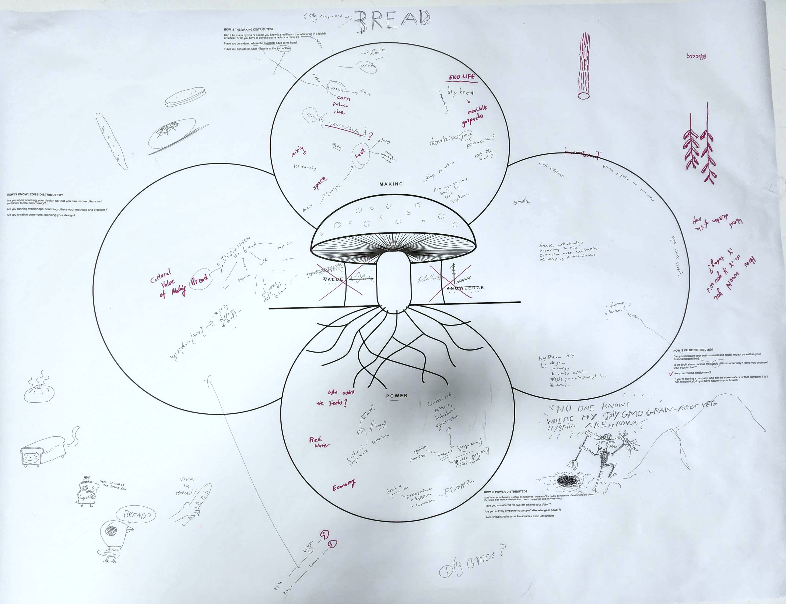

---
hide:
    - toc
---

# Distributed Design

**What is Distributed design?**

Emerging at the intersection of the Maker Movement and design sensibility, Distributed Design provides a framework for designers, makers and creatives to innovate the field of design towards more sustainable, open, inclusive and collaborative practices. As global challenges intensify, shifting the global paradigm to support global connectivity and local productivity where bits travel globally, while atoms stay local becomes urgent. Distributed Design is a proactive response for makers and designs to prefigure viable design alternatives to the current paradigm that is designed for mass consumption.
The Distributed Design Platform was established in 2017, co-funded by the Creative Europe program of the European Union. It brings together a diverse member-base from cultural and creative institutions including Fab Labs, cultural organisations, universities and makerspaces. The Platform provides Europe-wide programming and opportunities to support emerging creatives working in the emerging field of Distributed Design.

**1st day seminar "Mushroom Model":** 

Learning skills: i didnt have much experience on how bread is made so it was difficult to add specific info. I want to learn more about it as is something I eat almost everyday!
Dynamics: were open and we went deep in the origins of bread.
Interactions: I was able to give some good opinion to other groups as they were not going deep and just a superficial analysis of the product they chose.

**2nd day seminar "Reflection Tree":** 

Learning skills: This activity was really interesting! Unfortunately I had some personal paperwork appointments that day so I couldnt assist to the group activity, but I did it appart at the miro board. I feel that my project is well standing on the diverse frames and its a potential "distributed design" with many of the characteristics mentioned. But still think that there are lot of them that arent developed or designed yet to be sure they are working or they are on that line.
Dynamics: The chart is quick to fill and have the just phrases and words to think the several values of the project so makes a really nice dynamic activity.
Interactions: I didnt interact with the boards with other people yet, but I saw some boards to see the general interpretation of the values and understand the actual state of the different projects that are going on.

<iframe width="768" height="432" src="https://miro.com/app/live-embed/uXjVMURNReQ=/?moveToViewport=-43471,323908,83479,32998&embedId=611550568994" frameborder="0" scrolling="no" allow="fullscreen; clipboard-read; clipboard-write" allowfullscreen></iframe>

**3st day seminar "Value Presentation":** 

Learning skills: The values selected were difficult to chose, because they were many involved that I feel that are important for me. But I just chose one that I feel that can represent all of them: Collaboration/cooperation.
Dynamics: We talked about our value and express the importance and significance for us. Then we met in groups and decided some way of communicating it. We decided to create some presentation and started deconfiguring the meaning of collaboration by each word and looked for images and concepts that show what each word is for us. Was a nice activity and the group dynamic was fluid!
Interactions: All the presentations were great! All of us chose different ways of communicating the diverse values and some deep debates come out from the seminar!

