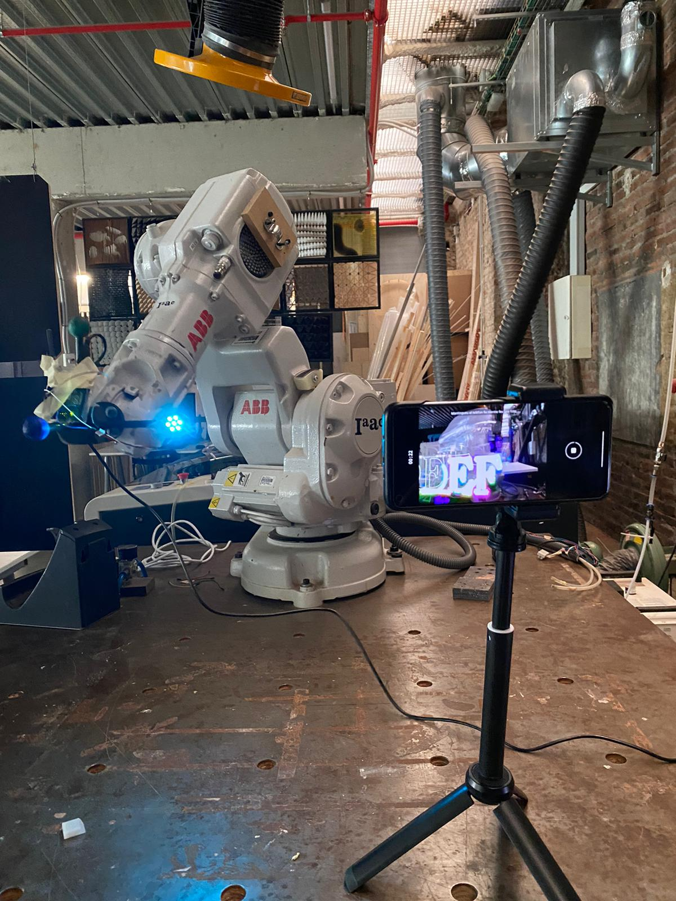
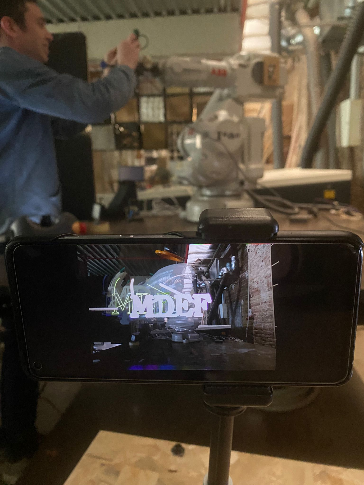

---
hide:
    - toc
---

# Digital Prototyping for Design

This term first seminar was about **ROBOTS!** 
by Josep

It was very interesting to learn basic things about how they work and all the things they can do. I have seen them in the car industry welding and doing other jobs but never used one in the "manual configuration". It would be nice to make some other things with them to learn more!

Next topic was **BLENDER!**

We learnt also basic tools in this great software, but what i liked most was learning the hole concept behind it. Victor taught us so many things about how was created, the values of the owner and organization. "Its a tool that is created by a comunity has more potential to be diverse in the paradigms it imposes. And also is an open source tool, so by definition allows (and even promotes) users to change it to fit our needs. I also learnt about the meaning of free software and in the case on Blender:

You are free to use Blender, for any purpose
You are free to distribute Blender
You can study how Blender works and change it
You can distribute changed versions of Blender

I really couldnt advance on the design and modelling of something but we started practicing with some 3d monkeys, and the class gave me some triggers to learn it in the future.

.png)

**Livecoding as Human Interface**
by Citlali Hernández & Xavi Domínguez 

.png)

In this class we understood some basic concepts to prototype an interface and navigate the immensity of possibilities, tools, technologies and languages to design and implement interfaces. Also learnt about the creative process of a transdisciplinary artist as Citlali who showed many interesting works combining technologies and human nature. Then we discovered and practiced a bit of livecoding by using the HYDRA WEB to create different sound and images live scenarios of what our computer cam and micro sensed.

*Blender interfaces*

In this seminar, we were immersed in a comprehensive exploration of Blender, delving into its various applications and the transformative potential it offers through Python scripting. Victor, adeptly guided us in the art of "hacking" Blender, unraveling a realm of endless possibilities.

Throughout the class, we embarked on an enthralling journey of modeling the visage of a mischievous monkey. This hands-on exercise allowed us to grasp the intricacies of Blender's functionalities as we experimented with an array of modifications and transformations.

The experience proved to be both enlightening and captivating, equipping us with a deeper understanding of Blender's artistic prowess. Through our collective exploration, we unveiled a newfound appreciation for the boundless creativity that can be unlocked within this remarkable software.