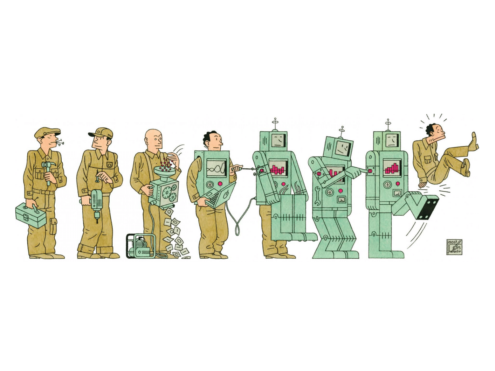
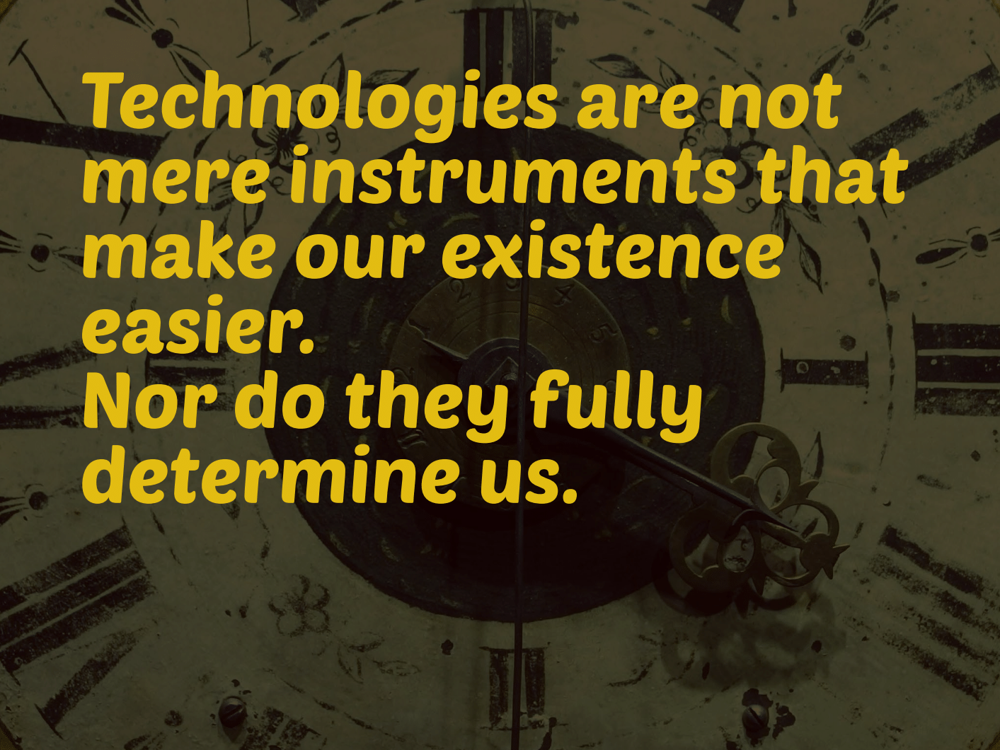

---
hide:
    - toc
---

# Design Ethics

I really liked the seminar, specially the first class. I really liked the way Ariel talks and gave interesting perspectives on different topics, with a really wide number of examples from books, experiences and general knowledge. I was so pensative and processing all the new insights spoken after the classes, for example how we (humans) many times just live without stopping to think many things we do without any sense. For me was like a really good resume for what Ive been living in these months in the master, a whole change of perspective of our purposes as beings in the planet and always its difficult to reflect it or re-communicate it to others, but Ariel could achieve it in almost one class, so I really appreciate it. Also for me was good to have an Argentinian voice on all this, because always we have european teachers and i think their perspective of things is so different because of their living experiences (away from latin america or southamerica experiences) in terms of colonization topics or other. So this gave me other energy and motivation for listening and considering everything Ariel spoke and we discussed.

