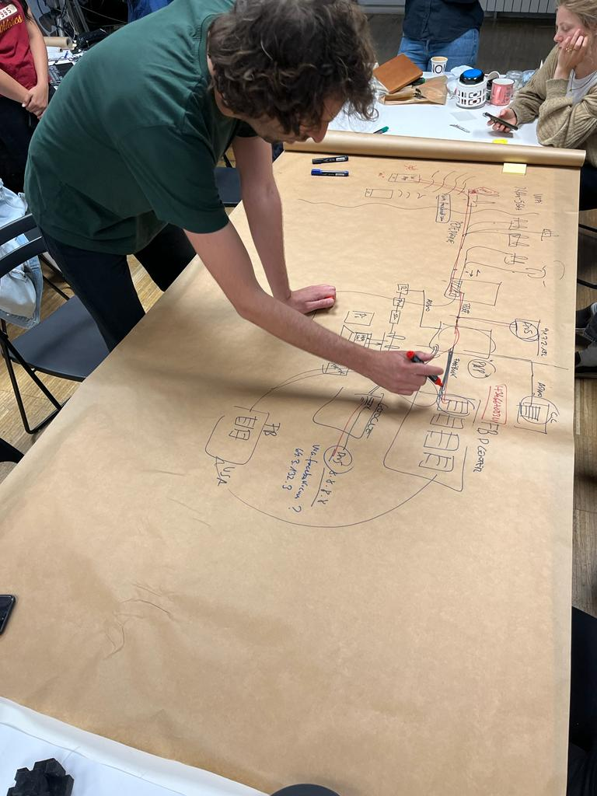
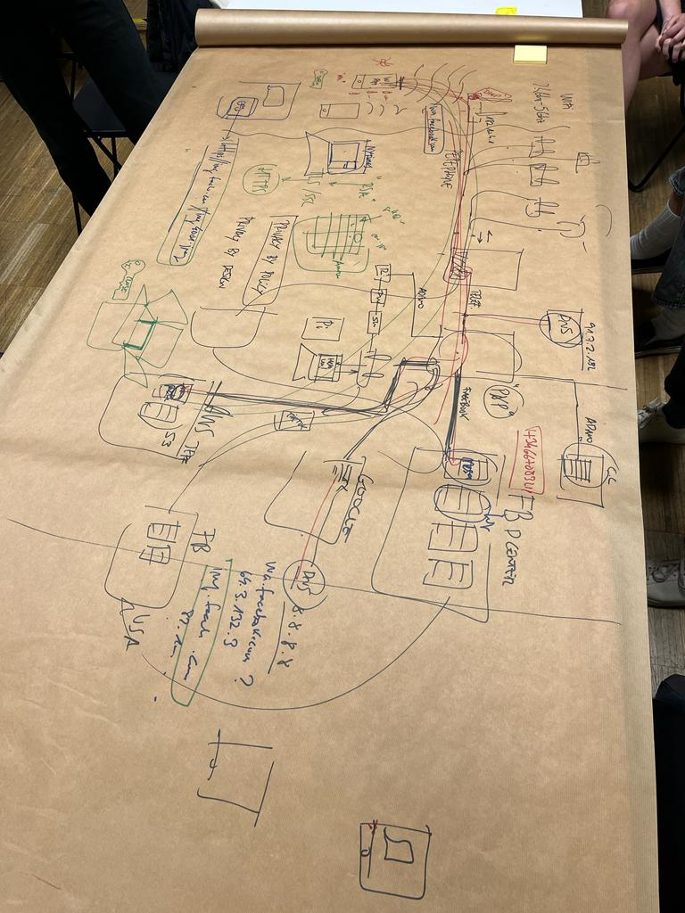

---
hide:
    - toc
---

# Decentralized Autonomous Organizations
by Guillem

Decentralized data and models examples as how the internet or social medias work.

Also about web3 and NFTs, having some debates and practical work as creating a virtual wallet -TEMPLE-, we learnt about TEZOS and also created a token image and uploaded to the OBJKT WEB and played buying and selling them between us. Then we created a concept of nft and how an idea could be developed in this path using web3. We thinked an idea with Antonio for bio-sense, showing the potential of the tokenization and the use of these technologies.

<iframe src="https://player.vimeo.com/video/830145574?h=274034e3f7&amp;badge=0&amp;autopause=0&amp;player_id=0&amp;app_id=58479" frameborder="0" allow="autoplay; fullscreen; picture-in-picture" allowfullscreen style="position:absolute;top:0;left:0;width:100%;height:100%;" title="video web3 bio-sense"></iframe>
